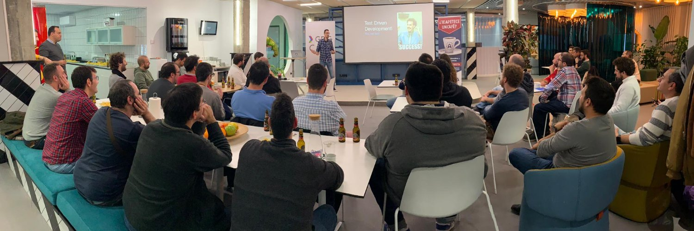

# Hi there 👋

I'm Jesus, an Agile Developer who strongly believes in eXtreme Programming Principles, Practices, and Values, and I try to apply them daily.

- 🔭 I’m currently working at [Celonis](https://www.celonis.com/)
- 💬 I love to work applying SOLID, TDD, BDD and Clean Code
- 🌱 I like to code in any language, but I mostly code with Java
- 👯 I'm taking part in some tech communities, like SVQ-JUG and Agile Sur
- 📫 Follow me at Twitter 
- 📫 Also you can have a look at my [professional github account](https://github.com/geeksusma-cdr)
- Formerly at:
  - [Codurance](https://www.codurance.com)
  - [Solera CoE](https://www.solerainc.es/)
  - [Wata Factory](https://wata.es/es/)
  - EPG (:zombie:)
  - [BestSecret](https://www.bestsecret.com/entrance/index.htm)
  - [Base100](https://base100.com/)
  - [everis Centers (now NTT DATA)](https://base100.com/)
  - Aticsa (:zombie:)
  - Area 10
  
## :people_hugging: Communities

I'm a member of [AgileSur](https://www.meetup.com/es-ES/agile-sur/)

In addition, I also support the next communities, attending regularly to their meetups when it is possible.

* [SVQ Java Users Group](https://www.meetup.com/svqjug/?_locale=es-ES)
* [Codurance Crafters](https://www.meetup.com/es-ES/codurance-craft-events/)

## :microphone: Talks

* [Agile para neofitos, no caigas en la trampa](https://www.youtube.com/watch?v=URaOdvW-Co0) - @ Aula de Emprendimiento del IES Rafael Alberti (Cadiz) - December of 2021 :warning: The first 10 minutes or so are muted :(
* [Por qué Scrum sin XP no vale un carajo](https://www.youtube.com/watch?v=kccvWjhg9Yw) - @ AgileSur - October 2021
* [TDD - Yes we can!](https://github.com/geeksusma/tdd-example) - @ Wata Academy - January 2020
* Testcontainers for never looking back - @ SVQ JUG - December 2019
* Scrum vs Fake Agile - @ GDG Cádiz - Abril 2019
* [Microservices vs Monolithic](https://www.youtube.com/watch?v=EBrudXtdsmY) - @ BetaBees Granada - December 2017
* [ElasticSearch first steps](https://www.youtube.com/watch?v=z0HQJfdpRV0) - @ BetaBeers Granada - February 2017

## :radio: Podcasts

* [Vue + Microfrontends at BiriBiriShow](https://anchor.fm/biri-biri-show/episodes/EP-28---micro-frontends--vuejs-y-como-siempre-SCRUM----con-Jesus-Mara-Villar-Vazquez-geeksusma-e1mlv6b) @ With Matheus Marabesi (@MatheusMarabesi) & JP Blanco (@JPBlancoDB) - August 2022
* [Surf, Punk y RevenueCat](https://trabajoenremoto.com/podcast/surf-punk-revenue-cat) @ With Miguel Carranza (@elwatto) - 2022
* Microfrontends and Agile @ With Playtomic Tech (@playtomictech) - 2021
* [Inclusividad en Agile 20 años después](https://trabajoenremoto.com/podcast/surf-punk-revenue-cat) @ With Cristina Santamarina (@crissantamarina) - 2021
* [Reclutamiento de perfiles IT](https://trabajoenremoto.com/podcast/reclutamiento-perfiles-it) @ With Julio César Pérez Arqués (@jcesarperez) - 2020

## :pen: Articles, publications, and blogs

* [Rest API Best Practices - 2nd Maturity Level](https://github.com/geeksusma/rest-2nd-level)
* Scrum Planning: The importance of a good task division.
  * [:es:](https://wata.es/es/scrum-planning-la-importancia-de-un-buen-tasking/)
  * [:uk:](https://wata.es/scrum-planning-the-importance-of-good-task-division/)
  * [:de:](https://wata.es/de/scrum-planning-die-bedeutung-einer-guten-aufgabenteilung/)
* [Día a día de un trabajador en remoto](https://trabajoenremoto.com/blog/dia-de-un-trabajador-remoto-jesus-maria-villar)

## :zombie: Side Project - KeenOn

Started with [Jorge Bachs](https://es.linkedin.com/in/jorge-bachs-rubio-7743175b), [Roberto Palomar](https://es.linkedin.com/in/roberto-palomar-ux) and finally, [Francisco Soto](https://es.linkedin.com/in/francisco-jos%C3%A9-soto-portillo-4557382b) joined us later. It was a new social network
to share your likes, create a list of hot spots and share them easily.

It was alive, running in prod from 2018 to 2020.

Some media report [here](https://blog.masmovil.es/keenon-la-aplicacion-para-compartir-lo-que-mas-te-gusta-de-una-ciudad/)
